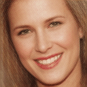
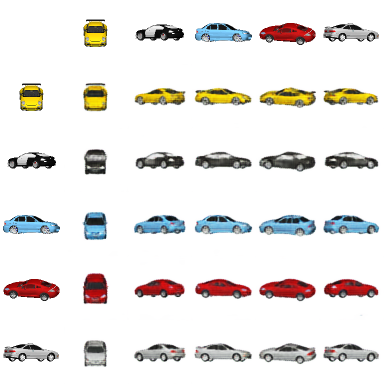
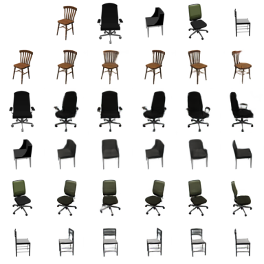
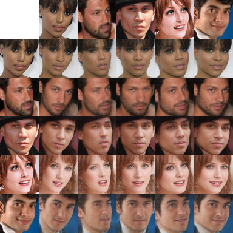
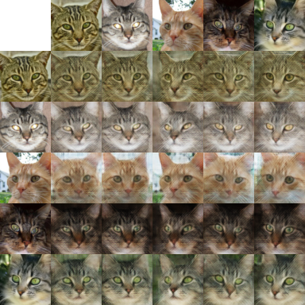
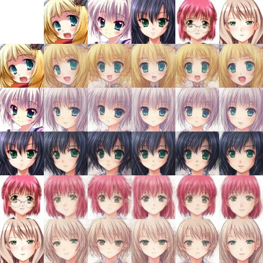
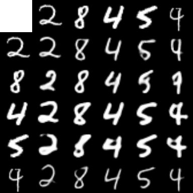
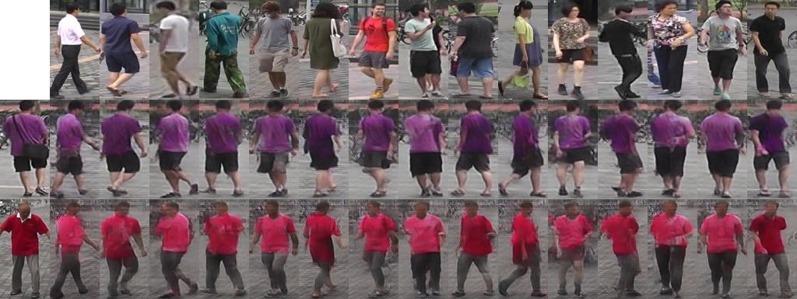
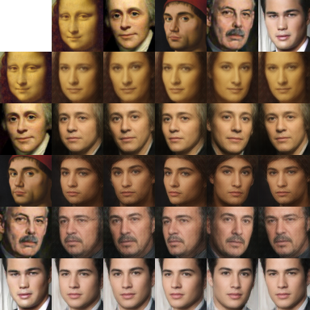
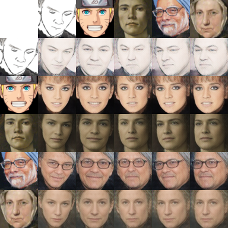

# Rethinking Content and Style: Exploring Bias for Unsupervised Disentanglement

> **Rethinking Content and Style: Exploring Bias for Unsupervised Disentanglement** <br>
> Xuanchi Ren, Tao Yang, Yuwang Wang and Wenjun Zeng <br>
> *arXiv preprint arXiv:2007.06600*
> 
[[Paper]()]
[[Project Page]()]
[[Demo]()]


**NOTE:** The following results are obtained in a completely *unsupervised* manner.

| Celeba | | |
| :-- | :-- | :-- |
|  |  | 
|  |  | 

## Content transfer
| Cars3D | Chairs | CelebA |
| :---: | :---: | :---: |
|  |  |  |
| Cat | Anime | MNIST |
|  |  |  |

| Market-1501 | 
| :---: | 
|  |

| Unseen Image Inference|  | 
| :---: | :---: |
|  |  |
    

## BibTeX

```bibtex
@article{shen2020closedform,
  title   = {Closed-Form Factorization of Latent Semantics in GANs},
  author  = {Shen, Yujun and Zhou, Bolei},
  journal = {arXiv preprint arXiv:2007.06600},
  year    = {2020}
}
```
